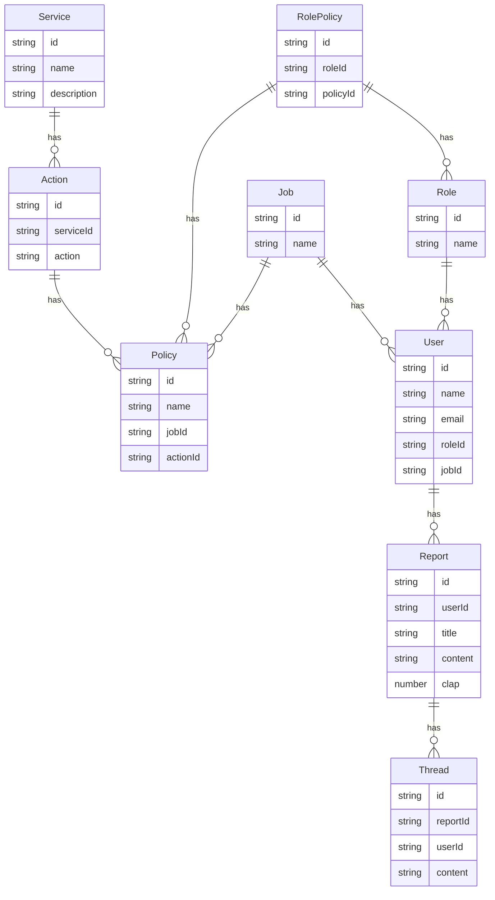

### 設計

作りたいシステムは以下の3つのサービスから構成される。

1. サービスの権限を編集することができるサービス
2. ユーザーの権限を編集することができるサービス
3. 日報システム

### issue list
- [ ] モデルの作成
  - [ ] PrismaのSchemaを作成
  - [ ] zodのバリデーションを自動生成
- [ ] モックデータの作成
  - [ ] モックデータを作成
  - [ ] seedコマンドを作成
- [ ] APIの作成
  - [ ] CRUDのエンドポイントを作成
  - [ ] テストを書く
